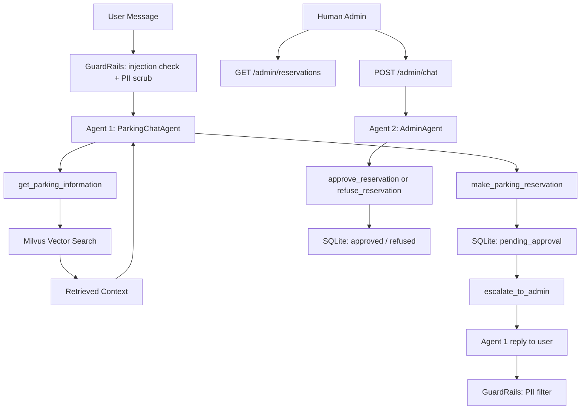

# Parking Agent System

A RAG-based parking assistant chatbot that answers questions about parking information, handles reservation requests, and routes them to a human administrator for approval.

---

## Submission Guide for Assessors

This project is built incrementally across stages. Errors and logic were refined progressively — some fixes introduced in a later stage also improved earlier stage code. For the corrected and complete code across all stages, please refer to the **`main` branch**.

---

## Architecture

```
User → Streamlit UI → FastAPI → Agent 1: ParkingChatAgent (MemorySaver)
                                      ├── get_parking_information → Milvus (static data)
                                      ├── make_parking_reservation → SQLite (pending_approval)
                                      └── escalate_to_admin → queues for human review

Admin → POST /admin/chat → Agent 2: AdminAgent (MemorySaver)
                                      ├── approve_reservation → SQLite (approved)
                                      └── refuse_reservation  → SQLite (refused)

Admin → GET /admin/reservations → list all pending reservations

Input  → GuardRails (DeBERTa injection check + Presidio PII scrub)
Output → GuardRails (Presidio PII filter)
```

## Project Structure

```
parking_agent_system/
├── data/
│   ├── parking_static_info.yaml     # Static parking knowledge base
│   └── evaluation_dataset.yaml      # RAG evaluation Q&A pairs
├── frontend/
│   └── app.py                       # Streamlit chat UI
├── reports/
│   └── evaluation_report.html       # Generated evaluation report
├── scripts/
│   ├── setup.py                     # One-time DB + vector store init
│   └── evaluate.py                  # RAG evaluation script
├── src/parking_agent_system/
│   ├── agents/
│   │   ├── user_agent.py            # Agent 1: chat + reservation + escalation
│   │   └── admin_agent.py           # Agent 2: approve/refuse via admin API
│   ├── api/
│   │   ├── routes_chat.py           # POST /chat (user-facing)
│   │   ├── routes_admin.py          # GET /admin/reservations, POST /admin/chat
│   │   └── schemas.py               # Pydantic request/response models
│   ├── config.py                    # All environment settings incl. RAG tuning
│   ├── data_layer/
│   │   ├── sql_manager.py           # SQLite reservation storage
│   │   └── vector_manager.py        # Milvus vector store
│   ├── guardrails/pii_guard.py      # Input/output safety filters
│   ├── services/
│   │   ├── reservation_service.py   # Reservation business logic
│   │   └── reservation_validation.py
│   ├── telemetry.py                 # Phoenix tracing setup
│   └── tools/
│       ├── parking_info.py          # RAG retrieval tool
│       ├── reservation.py           # Reservation booking tool
│       ├── escalate_to_admin.py     # Queues reservation for human admin review
│       ├── approve_reservation.py   # Sets reservation status to approved
│       └── refuse_reservation.py    # Sets reservation status to refused
├── tests/                           # pytest test suite
└── main.py                          # FastAPI app entry point
```

---

## Setup

### Prerequisites
- Python 3.13+
- [uv](https://docs.astral.sh/uv/) package manager
- [Ollama](https://ollama.ai) running locally with models pulled:

```bash
ollama pull qwen2.5:7b          # chat model (Agent 1 + Agent) + RAGAS judge
ollama pull nomic-embed-text    # embeddings
```

### Installation
```bash
uv sync
```

### One-time initialisation
Creates the SQLite schema and ingests static parking data into Milvus. Run once before starting the server.
```bash
uv run python scripts/setup.py
```

---

## Running

### Start Phoenix (observability)
```bash
uv run python -m phoenix.server.main serve
```
Open `http://localhost:6006` to view traces.

### Start the API server
```bash
uv run uvicorn main:app --reload
```

### Start the frontend
```bash
uv run streamlit run frontend/app.py
```

---

## Human-in-the-Loop Flow (Stage 2)

Agent 1 (user-facing) collects reservation details from the user and submits them to SQLite with status `pending_approval`. It then calls `escalate_to_admin` to notify the user that their booking is pending review.

Agent 2 (AdminAgent) sits behind the admin API. The human admin interacts with it via `POST /admin/chat`, sending the `reservation_id` (obtained from `GET /admin/reservations`) and a decision of `"approved"` or `"refused"`. The `reservation_id` is passed as the LangGraph thread ID so the agent's tools can look it up without the LLM needing to extract a UUID from the message.

AdminAgent uses its tools to update the reservation status in SQLite accordingly.

### Admin API endpoints

| Method | Endpoint | Description |
|---|---|---|
| `GET` | `/admin/reservations` | List all reservations pending approval |
| `POST` | `/admin/chat` | Send a decision message to AdminAgent |

**Example — list pending reservations:**
```bash
curl http://localhost:8000/admin/reservations
```

**Example — approve a reservation:**
```bash
curl -X POST http://localhost:8000/admin/chat \
  -H "Content-Type: application/json" \
  -d '{"reservation_id": "ed7757ae-b834-481f-9a61-93060ce97460", "message": "approved"}'
```

**Example — refuse a reservation:**
```bash
curl -X POST http://localhost:8000/admin/chat \
  -H "Content-Type: application/json" \
  -d '{"reservation_id": "ed7757ae-b834-481f-9a61-93060ce97460", "message": "refused"}'
```

---

## Evaluation

Runs RAGAS metrics (faithfulness, context precision/recall), Recall@K, Precision@K, Hit Rate@K, and latency across 10 test questions. Generates an Evidently HTML report and sends traces to Phoenix.

`qwen2.5:7b` is used for **both** the agent and the RAGAS judge. It offers strong tool/function calling for the agent and acceptable JSON-format compliance for the judge role at 7B scale. See the *Note on missing (N/A) RAGAS scores* below for the known trade-off.

> **Note:** Milvus Lite allows only one process to hold the database lock at a time. Stop the API server before running evaluation, otherwise you will get a `DataDirLockedError`. If the error still appears after stopping the server, find and kill the stale process:
> ```bash
> lsof data/milvus_parking.db/LOCK
> kill -9 <PID>
> ```

### Note on missing (N/A) RAGAS scores

Some rows in `reports/evaluation_results.csv` show empty values for `faithfulness`
and/or `context_precision`. Two independent causes:

1. **No context retrieved.** When the agent chooses `make_parking_reservation`
   instead of `get_parking_information`, `retrieved_contexts` is empty and
   RAGAS cannot compute `faithfulness`.

2. **Judge LLM JSON parse failures.** Because a single 7B model
   (`qwen2.5:7b`) serves as both agent and judge, judge outputs occasionally
   deviate from the strict JSON schema RAGAS expects — especially for
   `faithfulness` and `context_precision`, which require per-claim /
   per-context verdicts on longer answers. RAGAS silently records `NaN` for
   those (row, metric) pairs. `context_recall` is more robust because it
   only decomposes the short ground-truth answer.

Deterministic retrieval metrics (`Recall@K`, `Precision@K`, `Hit Rate@K`,
`latency_ms`) are unaffected. A larger judge model (e.g. `qwen2.5:14b` or a
hosted API) would reduce cause 2 further.

```bash
uv run python scripts/evaluate.py
```

Report saved to `reports/evaluation_report.html`.

---

## Tests

```bash
uv run pytest tests/
```

---

## RAG Pipeline



## Data Model

| Data Type | Storage | Examples |
|---|---|---|
| Static | Milvus (vector) | Location, hours, pricing, rules, contact |
| Dynamic | SQLite | Reservation requests, status |

## Guard Rails

- **Input**: DeBERTa-based ML classifier (`ProtectAI/deberta-v3-base-prompt-injection`) detects prompt injection attempts
- **Input**: Presidio scrubs PII (credit cards, SSNs) before reaching the LLM
- **Output**: Presidio anonymizes sensitive entities in responses

## Evaluation Metrics

| Metric | Description |
|---|---|
| Recall@K | What fraction of relevant documents appeared in the top K results? |
| Precision@K | Normalized: `hits / min(K, num_relevant_docs)` — avoids the misleading 1/K floor when a question has only one labeled relevant document |
| Faithfulness | Is the answer grounded in the retrieved context? |
| Context Precision | Are the retrieved contexts relevant to the question? |
| Context Recall | Does the retrieved context cover the ground truth answer? |
| Latency | End-to-end response time per query |

---

## Future Improvements

### Reranking
After the initial vector search, add a cross-encoder reranker (e.g. `cross-encoder/ms-marco-MiniLM-L-6-v2`) to re-score the top-K candidates and promote the most relevant documents before passing context to the LLM. This is especially useful when the embedding model retrieves semantically similar but less precise results.

### Hybrid Search
Combine dense vector search (current) with sparse BM25 keyword search. Hybrid search improves retrieval for queries that contain specific terms (e.g. phone numbers, exact prices) that dense embeddings can underweight.

### Hyperparameter Evaluation
The current evaluation uses fixed values (`chunk_size=500`, `chunk_overlap=50`, `top_k=5`, `temperature=0.0`). A grid-search evaluation across these parameters would show how each affects retrieval and answer quality metrics. Skipped for now because the dataset is small (10 questions) and current results are already strong — worth revisiting with a larger evaluation set.

### Chunking Strategy
The current implementation uses fixed-size chunking (`chunk_size=500`, `chunk_overlap=50`). Alternative strategies worth exploring as the knowledge base grows:
- **Semantic chunking** — splits on meaning boundaries rather than character count, keeping related sentences together
- **Sentence-window chunking** — retrieves individual sentences but passes surrounding context to the LLM for better coherence
- **Auto-merging retrieval** — stores documents at multiple granularities (small chunks for retrieval, larger parent chunks for context) and merges retrieved child chunks back to their parent before passing to the LLM
