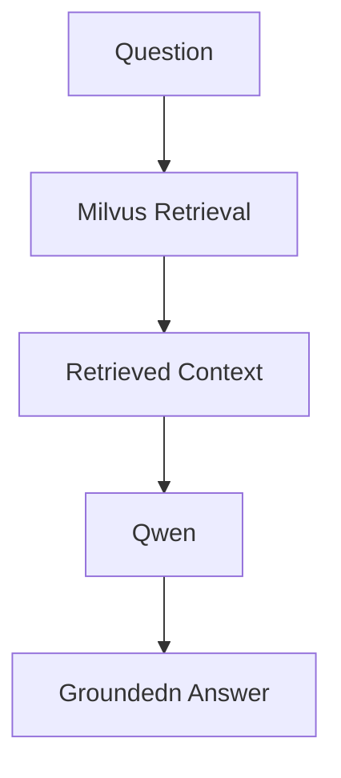

# Setup

## Prerequisites
- [Ollama](https://ollama.ai) running locally with the required models pulled:
  ```bash
  ollama pull qwen2.5:7b
  ollama pull nomic-embed-text
  ```

## Installation
```bash
uv sync
```

## One-time initialisation
Run once before starting the server for the first time. Creates the SQLite schema and ingests static parking data into Milvus.
```bash
uv run python scripts/setup.py
```

## Start the server
```bash
uv run uvicorn main:app --reload
```

## Start the frontend
```bash
uv run streamlit run frontend/app.py
```
## Start the Phoneix
```bash
run uv run python -m phoenix.server.main serve
```
---

# The RAG Pipeline

