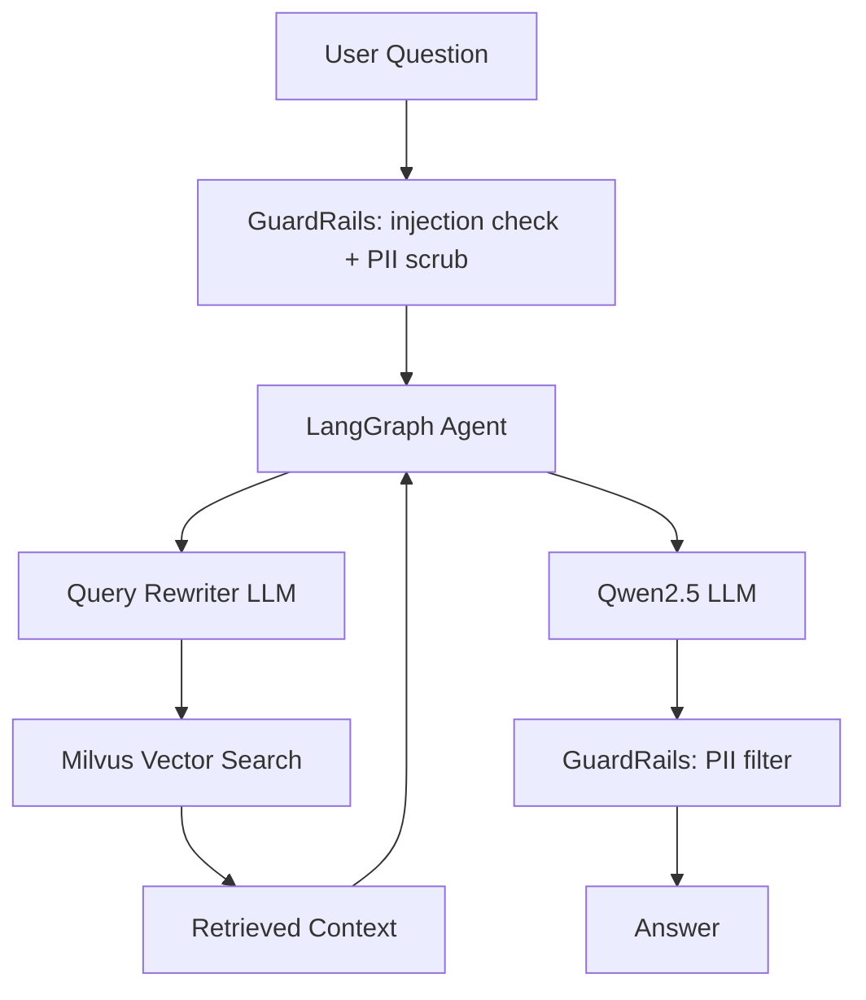

# Parking Agent System

A RAG-based parking assistant chatbot that answers questions about parking information and handles reservation requests.

---

## Architecture

```
User → Streamlit UI → FastAPI → LangGraph Agent (MemorySaver)
                                      ├── get_parking_information → Milvus (static data)
                                      └── make_parking_reservation → SQLite (reservations)

Input  → GuardRails (DeBERTa injection check + Presidio PII scrub)
Output → GuardRails (Presidio PII filter)
```

## Project Structure

```
parking_agent_system/
├── data/
│   ├── parking_static_info.yaml     # Static parking knowledge base
│   └── evaluation_dataset.yaml      # RAG evaluation Q&A pairs
├── frontend/
│   └── app.py                       # Streamlit chat UI
├── reports/
│   └── evaluation_report.html       # Generated evaluation report
├── scripts/
│   ├── setup.py                     # One-time DB + vector store init
│   └── evaluate.py                  # RAG evaluation script
├── src/parking_agent_system/
│   ├── agents/user_agent.py         # LangGraph agent with MemorySaver
│   ├── api/                         # FastAPI routes and schemas
│   ├── config.py                    # Environment settings
│   ├── config_rag.py                # RAG tuning parameters
│   ├── data_layer/
│   │   ├── sql_manager.py           # SQLite reservation storage
│   │   └── vector_manager.py        # Milvus vector store
│   ├── guardrails/pii_guard.py      # Input/output safety filters
│   ├── services/
│   │   ├── reservation_service.py   # Reservation business logic
│   │   └── reservation_validation.py
│   ├── telemetry.py                 # Phoenix tracing setup
│   └── tools/
│       ├── parking_info.py          # RAG retrieval tool
│       └── reservation.py           # Reservation booking tool
├── tests/                           # pytest test suite
└── main.py                          # FastAPI app entry point
```

---

## Setup

### Prerequisites
- Python 3.13+
- [uv](https://docs.astral.sh/uv/) package manager
- [Ollama](https://ollama.ai) running locally with models pulled:

```bash
ollama pull qwen2.5:7b
ollama pull nomic-embed-text
```

### Installation
```bash
uv sync
```

### One-time initialisation
Creates the SQLite schema and ingests static parking data into Milvus. Run once before starting the server.
```bash
uv run python scripts/setup.py
```

---

## Running

### Start Phoenix (observability)
```bash
uv run python -m phoenix.server.main serve
```
Open `http://localhost:6006` to view traces.

### Start the API server
```bash
uv run uvicorn main:app --reload
```

### Start the frontend
```bash
uv run streamlit run frontend/app.py
```

---

## Evaluation

Runs RAGAS metrics (faithfulness, context precision/recall), Recall@K, Precision@K, and latency across 10 test questions. Generates an Evidently HTML report and sends traces to Phoenix.

```bash
uv run python scripts/evaluate.py
```

Report saved to `reports/evaluation_report.html`.

---

## Tests

```bash
uv run pytest tests/
```

---

## RAG Pipeline



## Data Model

| Data Type | Storage | Examples |
|---|---|---|
| Static | Milvus (vector) | Location, hours, pricing, rules, contact |
| Dynamic | SQLite | Reservation requests, status |

## Guard Rails

- **Input**: DeBERTa-based ML classifier (`ProtectAI/deberta-v3-base-prompt-injection`) detects prompt injection attempts
- **Input**: Presidio scrubs PII (credit cards, SSNs) before reaching the LLM
- **Output**: Presidio anonymizes sensitive entities in responses

## Evaluation Metrics

| Metric | Description |
|---|---|
| Recall@K | Did the relevant document appear in top K retrieved results? |
| Precision@K | What fraction of top K results were relevant? |
| Faithfulness | Is the answer grounded in the retrieved context? |
| Context Precision | Are the retrieved contexts relevant to the question? |
| Context Recall | Does the retrieved context cover the ground truth answer? |
| Latency | End-to-end response time per query |
